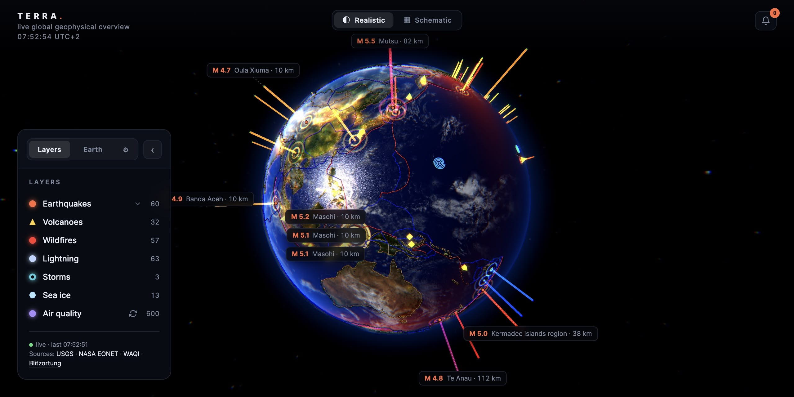

# Terra

I wanted to know whether the earthquakes that make the news are the big ones.

Terra is an interactive Three.js/WebGL globe that plots live geophysical data on Earth:
earthquakes, volcanoes, wildfires, storms and sea ice, each as its own layer
with its own 3D indicator.

It is static HTML. No build step, no bundler, no framework. Open the file and
it runs.

Updates to come!



**[Live demo](https://terra.terryelemans.nl)** · **[Download terra.html](https://github.com/Lemans73/Terra/releases/latest/download/terra.html)**
— one HTML file you can open straight from your desktop, no server and no clone.
It still needs an internet connection: the map textures and the live feeds come
over the network.

Earthquakes (USGS) and natural events (NASA EONET) work out of the box with no
API key. Air quality and lightning need your own key or a local relay, see
Optional layers below.

## Layers and sources

| Layer | Source | Notes |
|---|---|---|
| Earthquakes | [USGS](https://earthquake.usgs.gov/earthquakes/feed/) | magnitude-scaled, filterable by time window |
| Volcanoes | [NASA EONET](https://eonet.gsfc.nasa.gov/) | |
| Wildfires | NASA EONET | North America only — see limitations |
| Storms | NASA EONET | |
| Sea ice | NASA EONET | |
| Air quality | [WAQI](https://waqi.info/) | needs a key, follows the camera |
| Lightning | [Blitzortung](https://www.blitzortung.org/) | needs a relay you run yourself |

Plus three vector overlays: tectonic plate boundaries, country borders and
country labels.

Two display modes. **Realistic** is the shaded Earth with volumetric
indicators. **Schematic** is a flat vector map with discipline-specific symbols
and no bloom.

## Running it locally

```bash
git clone https://github.com/Lemans73/Terra.git
cd Terra
node serve.mjs
```

Then open `http://localhost:8771`.

Node 18 or newer. There are no dependencies to install — the `package.json`
exists only to mark the project as ESM, and has no `dependencies` block.

**Opening `index.html` directly will not work.** The application uses ES
modules, which browsers refuse to load over `file://`. That is what the server
is for.

### The single-file build

If you want a version you can double-click or send to someone, build it:

```bash
node tools/build-standalone.mjs
```

That writes `terra.html` — one file, no server. It inlines the CSS and the local
modules, and points the textures and GeoJSON at jsDelivr, which serves this
repository with the CORS headers a `file://` page needs. It is a generated file
and git-ignored: edit `index.html` and `js/*.js`, then rebuild. It is also the
name the Release asset carries, which is what the download link above resolves
to.

Two layers are locked in that build, and cannot be otherwise: air quality needs
a token behind a server route, and lightning needs a relay holding a WebSocket
open. Neither exists in a file you opened from your desktop.

## Bring your own data

Terra's fetch loop knows nothing about any specific layer. Adding a source
means writing an adapter object and registering it — you never touch the loop
itself.

**Required:**

| Property | Meaning |
|---|---|
| `layers` | the layer keys this adapter feeds |
| `url` | endpoint — a string, or a getter if it depends on camera state |
| `interval` | poll interval in milliseconds |
| `normalize(json)` | turn the response into `{ id, layer, lat, lng, value, label, time, source }` items |

**Optional, for the awkward cases:**

| Property | For |
|---|---|
| `merge(prev, fresh)` | sources that accumulate history rather than replace it — lightning uses this |
| `health(json)` | sources where "reachable" and "returning data" are different questions |
| `healthId` | share one status indicator across several adapters — the four EONET categories do |
| `keepOnEmpty` | treat an empty response as a hiccup rather than as truth |
| `optional` | on failure, padlock the layer instead of reporting the whole app degraded |
| `offlineNote` | the text shown inside that padlock |

An adapter marked `optional` that fails puts its layers behind a padlock with
an expandable panel explaining how to connect a backend. When the source comes
back, the padlock lifts and the layer restores its previous state.

`normalize` returning `[]` is a valid answer meaning "nothing to show" — unless
`keepOnEmpty` says otherwise.

### Adding an API key

Air quality needs a free WAQI token. The key never reaches the browser: it
lives in the `WAQI_TOKEN` environment variable and is read server-side by
`api/waqi.js`, which returns only the data.

**We do not distribute keys.** To get air quality in your own deployment:

1. Request a free token at [aqicn.org/data-platform/token](https://aqicn.org/data-platform/token/)
2. Deploy this repository to Vercel (or any host that runs serverless functions)
3. Set `WAQI_TOKEN` in your project's environment variables

Locally, put it in a `.env.local` file at the repository root:

```
WAQI_TOKEN=your_token_here
```

That file is git-ignored. Note that `serve.mjs` reads it once at startup —
change it and you must restart the server.

Without a token, `/api/waqi` returns 404 and the layer shows a padlock. That is
the expected state, not an error.

### Lightning

Lightning comes from Blitzortung over a WebSocket, which serverless platforms
cannot hold open. The relay in `relay/relay.mjs` is a separate process you run
yourself:

```bash
node relay/relay.mjs
```

It listens on port 8772 and has no dependencies. The globe detects a relay on
localhost automatically; to point at one elsewhere, set `RELAY_URL` in
`js/config.js`. Without a relay, the lightning layer is padlocked.

## Configuration

`js/config.js` is the single source of truth for defaults: `PARAMS` holds every
tunable value, `COLORS` the palette, `TEXTURE_SETS` the imagery. Most visual
behaviour can be changed there without touching application code.

## Limitations, honestly

- **Wildfires are North America only.** NASA EONET's coverage, not a bug.
  Global coverage would mean a second source (GWIS/Copernicus); it is on the
  list, not in the code.
- **Lightning needs a process you run yourself.** There is no hosted relay.
- **WAQI and Blitzortung permit non-commercial use only.** Terra is therefore a
  free demonstration and will stay one. If you fork it, that constraint travels
  with those two sources.
- **The `document.hidden` trap.** In headless browsers and background tabs,
  `requestAnimationFrame` does not fire, so animations freeze and the poll loop
  skips. Expected behaviour, not a bug worth reporting.
- **Comments in the source are in Dutch**, apart from the configuration file,
  the adapter contract and the server files, which are English. The interface
  itself is entirely English.

## A note on scope

Terra is a demo, built in spare time. It works and it is honest about what it
cannot do, but it is not a maintained product and there is no roadmap. Updates
arrive when they arrive.

You are welcome to fork it, take it apart, or connect your own sources — that
is much of why it is here. Issues and questions are read, and answered when
there is time for them. Just don't plan around a fix landing this week.

## Attribution

Imagery, map data and feeds carry their own licenses, several of which require
credit. See [ATTRIBUTION.md](ATTRIBUTION.md) for the full list — in short:
textures from [Solar System Scope](https://www.solarsystemscope.com/textures/)
under CC BY 4.0, plate boundaries from
[PB2002](https://github.com/fraxen/tectonicplates) under ODC-BY 1.0, and
Natural Earth in the public domain.

## License

MIT for the source code — see [LICENSE](LICENSE). The data and imagery are
under their own terms, listed in `ATTRIBUTION.md`.

Built by NimbusAgency.nl | Interactive Media.
